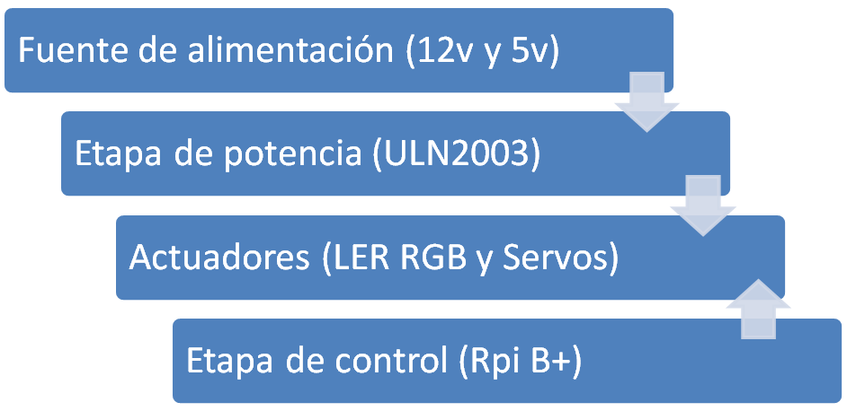
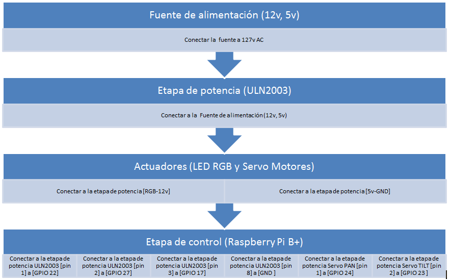
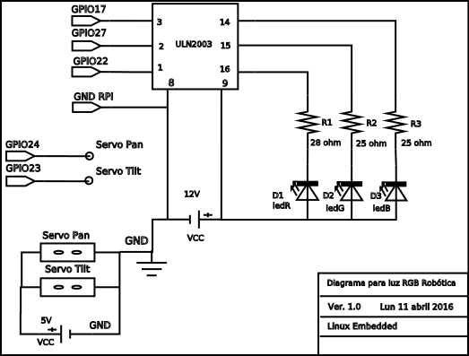

# Luz robotica RGB

## Manual tecnico 

### Estructura del documento MANUAL TECNICO

1. Indice

> Fuente de alimentacion
> Etapa de potencia
> Actuadores
> Etapa de control

2. Introduccion.

> La luz robotica RGB controlada por Raspberry py, es un sistema de iluminacion robotica la cual puede reproducir una gama  de colores de 16,7 millones, a si como modificar su posicion en dos grados de libertad.
> Objetivo general del sistema
> Esta luz robotica RGB  su gama de colores y su posicion.

3. Contenido tecnico

>## Diagramas de flujo de datos 

> 
 
>## Diagramas de conexion a bloques 

> 

>## Diagrama esquematico
 
> 
